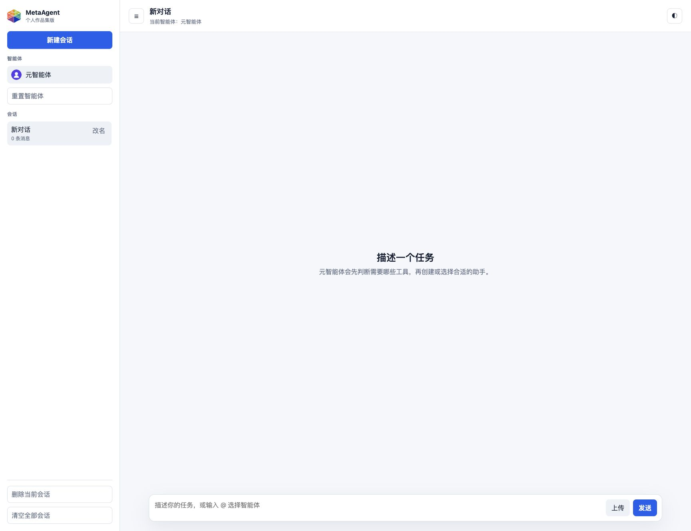
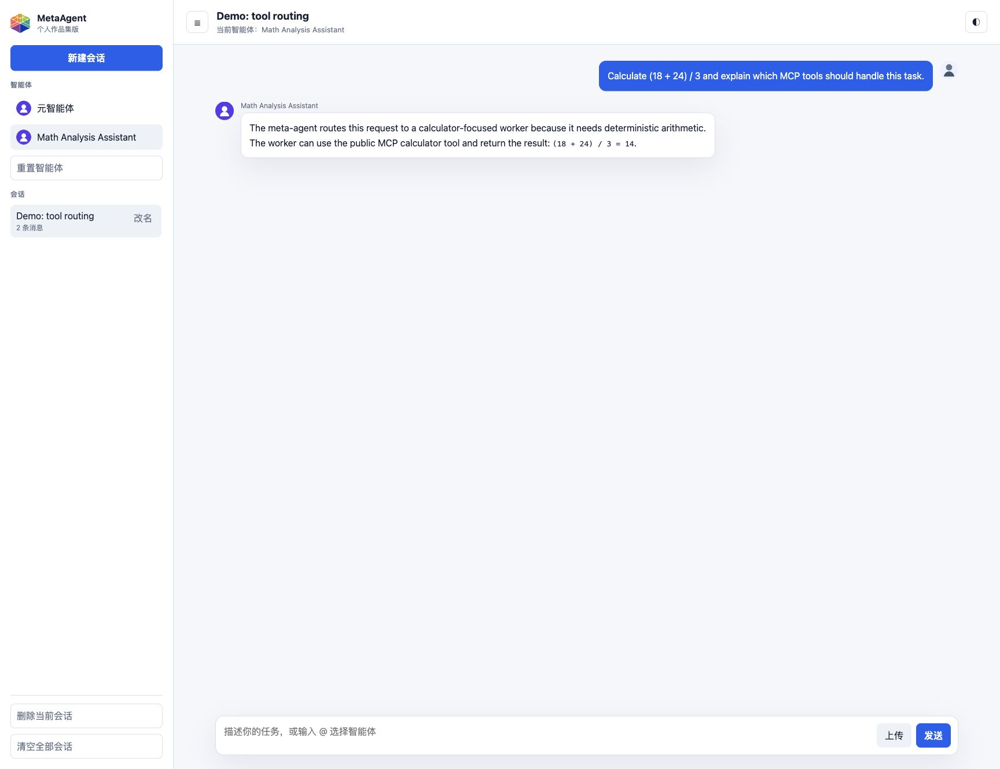
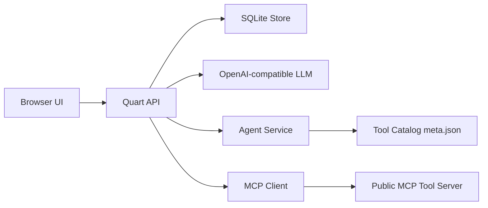

# MetaAgent

MetaAgent is a portfolio-ready web chat application that demonstrates a **meta-agent + MCP tool-calling workflow**. A user describes a task, the meta-agent decides which capability group is needed, creates or selects a specialized agent, and the selected agent can call public MCP tools to complete the task.

This repository is the public version of the project. It is designed to be reproducible, safe to publish, and easy to run locally.

## Screenshots





## Highlights

- **Meta-agent routing**: maps user requests to capability groups and creates task-specific agents.
- **MCP tool integration**: discovers and calls public MCP tools through a Python MCP client.
- **Streaming chat UI**: supports SSE streaming, Markdown rendering, tool-call cards, file upload UI, dark mode, and responsive layout.
- **SQLite-backed state**: stores users, sessions, messages, agents, and upload metadata in a local SQLite database.
- **Public-safe project shape**: excludes local secrets, runtime data, upload files, private services, and user history from Git.

## Architecture



Core directories:

- `meta_agent_app/`: configuration, storage, LLM client, agent orchestration, MCP client, and routes.
- `mcp/server/mcp_server/`: public demo MCP tool server.
- `templates/` and `static/`: single-page web chat interface.
- `tests/`: backend and API tests.

## What It Can Do

The public demo tool catalog includes:

- **General utilities**: internet time, weekday, and time shifting.
- **Calculator tools**: expression evaluation, equations, derivatives, integrals, statistics, regression, and matrix operations.
- **Data analysis tools**: data quality checks, missing-value handling, standardization, classification, clustering, and dimensionality reduction.
- **Data visualization tools**: line, bar, scatter, pie, and box plots from uploaded tabular data.

## Model and API Key Behavior

This project does **not** include a bundled model or a bundled API key.

- If `OPENAI_API_KEY` is configured, MetaAgent uses the OpenAI-compatible endpoint and model configured in `.env`.
- If no API key is configured, the meta-agent falls back to a local keyword-based demo router. This lets the UI demonstrate agent creation, but real LLM responses and tool-calling conversations require a valid API key.
- Every user should provide their own API key locally. Never commit `.env`.

## Quick Start

Requirements:

- Python 3.11+
- Node.js only if you enable optional Node-based MCP servers

Install and run:

```bash
python --version
python -m venv .venv
source .venv/bin/activate
pip install -r requirements.txt
cp .env.example .env
```

Edit `.env`:

```bash
OPENAI_API_KEY=your_api_key
MODEL=gpt-4o-mini
```

Start the app:

```bash
python app.py
```

Open:

```text
http://127.0.0.1:18899
```

Production-style local launch:

```bash
hypercorn app:app --bind 127.0.0.1:18899
```

## Demo Prompts

Try these prompts in the web UI:

- `Calculate the mean and standard deviation of 12, 18, 21, and 30.`
- `Solve x**2 - 5*x + 6 = 0.`
- `What day of the week is it in Beijing today? What date is three days later?`
- `I uploaded a CSV file. Check its data quality and summarize missing values.`
- `Create a bar chart from the uploaded data.`

## Environment Variables

`.env.example` contains the supported settings:

- `OPENAI_API_KEY`: your model API key.
- `OPENAI_BASE_URL`: optional OpenAI-compatible base URL.
- `MODEL`: model name, defaulting to `gpt-4o-mini`.
- `METAAGENT_DATA_DIR`: local runtime data directory, defaulting to `data/`.
- `DATABASE_PATH`: SQLite database path inside the data directory.
- `UPLOAD_DIR`: local upload directory.
- `MCP_SERVER_CONFIG_PATH`: MCP server configuration file.
- `METAAGENT_PYTHON_PATH`: optional Python interpreter path for MCP subprocesses.

## Local Data and Privacy

Runtime data is stored locally:

- SQLite database: `data/metaagent.sqlite3`
- Uploaded files: `data/uploads/`
- Local secrets: `.env`

These paths are ignored by Git. They are not meant to be uploaded to GitHub.

If you want to reset local state:

```bash
rm -rf data uploads
```

## Tests

Run:

```bash
pytest
```

Repository hygiene checks:

```bash
rg -n "sk-[A-Za-z0-9]|tvly-[A-Za-z0-9]|Bearer [A-Za-z0-9]|verify=False"
git ls-files .env 'data/**' 'static/users/**' '*__pycache__*'
```

The first command should not find real secrets. The second command should not output tracked runtime data.

## Portfolio Notes

This public version focuses on the core engineering story:

- decomposing a large single-file prototype into service-oriented backend modules;
- replacing mixed JSON/localStorage state with SQLite-backed server state;
- integrating MCP tool discovery and tool calls with a streaming LLM chat flow;
- rebuilding the web UI for a cleaner session, agent, upload, and mobile experience;
- preparing the repository for safe public sharing.

## License

MIT License.
